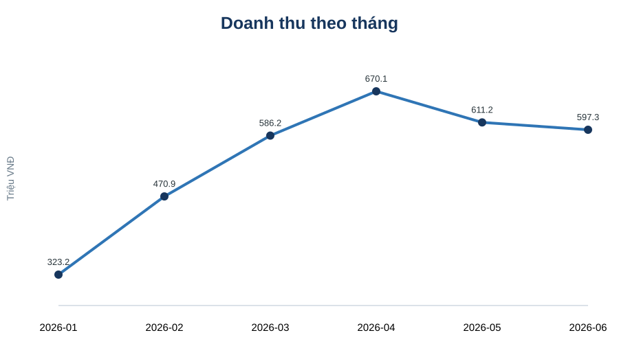
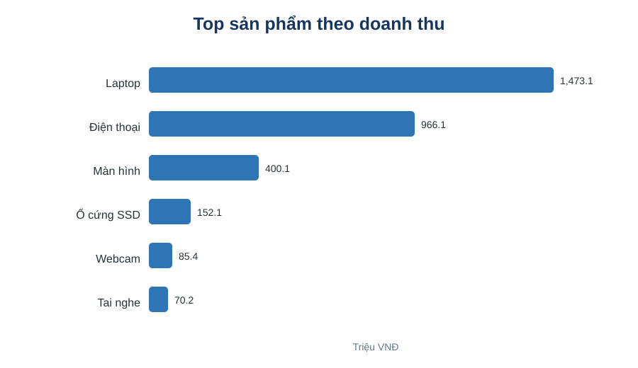
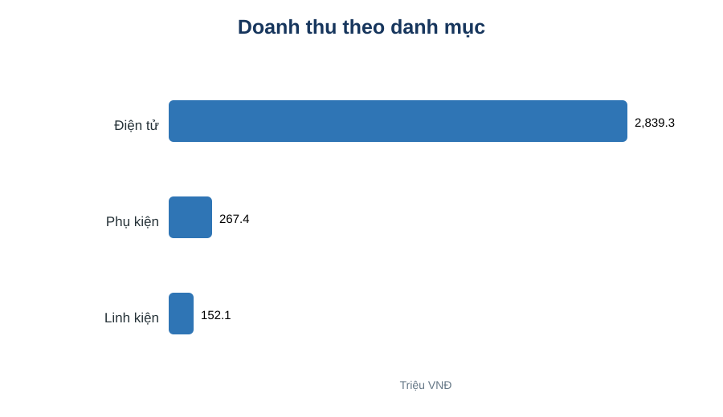
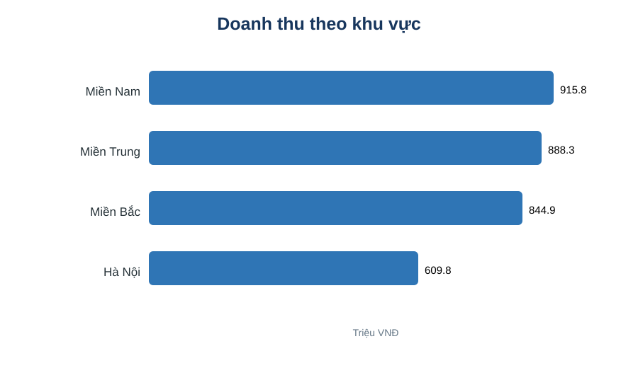
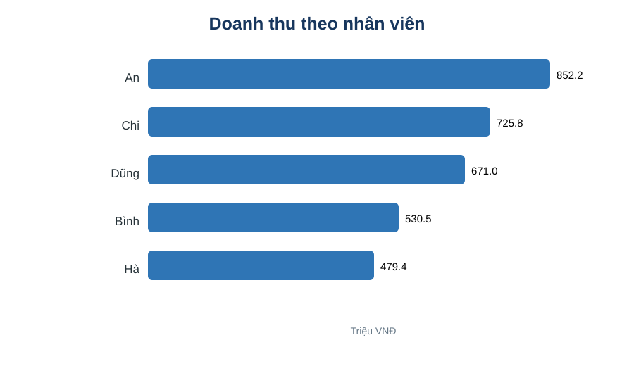

# Phân tích dữ liệu bán hàng bằng Python

Dự án cá nhân thuộc nội dung **5.5 - Phân tích dữ liệu cơ bản với NumPy, Pandas và Matplotlib**.

**Sinh viên:** Bùi Phạm Anh Giang  
**Lớp:** T26CQHT01-B  
**Trường:** Học viện Công nghệ Bưu chính Viễn thông  
**Cố vấn học tập:** Thầy Nguyễn Quang Huy

## 1. Giới thiệu

Dự án xây dựng một quy trình phân tích dữ liệu bán hàng bằng Python, từ khâu đọc và tiền xử lý dữ liệu đến thống kê, tổng hợp theo nhiều chiều và trực quan hóa kết quả. Bộ dữ liệu được sử dụng cho mục đích học tập và gồm 240 đơn hàng trong 6 tháng đầu năm 2026.

## 2. Mục tiêu

- Đọc và tổ chức dữ liệu CSV bằng Pandas.
- Kiểm tra, làm sạch và chuẩn hóa dữ liệu.
- Tính các chỉ số thống kê bằng NumPy/Pandas.
- Phân tích doanh thu và số lượng theo tháng, sản phẩm, danh mục, khu vực và nhân viên.
- Trực quan hóa kết quả bằng Matplotlib.
- Tổ chức mã nguồn và kết quả theo hướng có thể kiểm tra và tái lập.

## 3. Công nghệ sử dụng

- Python
- NumPy
- Pandas
- Matplotlib
- Visual Studio Code
- GitHub

## 4. Cấu trúc repository

```text
sales-data-analysis-python/
├── sales_analysis.py
├── sales_data.csv
├── README.md
└── images/
    ├── doanh_thu_theo_thang.svg
    ├── top_san_pham_doanh_thu.svg
    ├── doanh_thu_theo_danh_muc.svg
    ├── doanh_thu_theo_khu_vuc.svg
    └── doanh_thu_theo_nhan_vien.svg
```

## 5. Phương pháp phân tích

Chương trình đọc dữ liệu từ `sales_data.csv`, chuyển đổi trường ngày bán sang kiểu thời gian, loại bỏ dữ liệu trùng hoặc thiếu nếu có, sau đó sử dụng `groupby()` để tổng hợp dữ liệu theo các chiều phân tích. Các bảng kết quả được sử dụng làm đầu vào cho Matplotlib để tạo biểu đồ.

## 6. Cách chạy chương trình

Cài đặt các thư viện cần thiết:

```bash
pip install numpy pandas matplotlib
```

Chạy chương trình:

```bash
python sales_analysis.py
```

Sau khi thực thi, chương trình in kết quả phân tích ra Terminal và lưu các biểu đồ vào thư mục `images/`.

## 7. Kết quả trực quan

### 7.1. Doanh thu theo tháng


### 7.2. Top sản phẩm theo doanh thu


### 7.3. Doanh thu theo danh mục


### 7.4. Doanh thu theo khu vực


### 7.5. Doanh thu theo nhân viên


## 8. Kết quả chính

| Chỉ số | Kết quả |
|---|---:|
| Tổng doanh thu | 3.258.823.000 VNĐ |
| Tổng số lượng bán | 703 sản phẩm |
| Tháng có doanh thu cao nhất | 04/2026 |
| Sản phẩm có doanh thu cao nhất | Laptop |
| Danh mục có doanh thu cao nhất | Điện tử |
| Khu vực có doanh thu cao nhất | Miền Nam |
| Nhân viên có doanh thu cao nhất | An |

## 9. Video demo

Video demo trình bày quy trình thực hiện dự án gồm: giới thiệu repository, dữ liệu đầu vào, mã nguồn, chạy chương trình trên VS Code/Terminal và kiểm tra các biểu đồ kết quả.

> **Video demo:** tệp video đã được hoàn thiện. Liên kết xem trực tuyến sẽ được bổ sung tại đây sau khi video được tải lên một nền tảng có URL truy cập ổn định (ví dụ Google Drive hoặc YouTube ở chế độ phù hợp).

## 10. Khả năng tái lập

Mã nguồn, dữ liệu đầu vào và các kết quả trực quan được tổ chức trong cùng repository. Người đọc có thể tải repository, cài đặt các thư viện cần thiết và chạy lại `sales_analysis.py` để đối chiếu kết quả. Cách tổ chức này hỗ trợ tính minh bạch và khả năng kiểm chứng của dự án.

## 11. Hạn chế và hướng phát triển

Bộ dữ liệu hiện tại là dữ liệu mô phỏng và mới bao phủ sáu tháng. Dự án có thể được phát triển bằng cách bổ sung dữ liệu thực tế, giá vốn và lợi nhuận; kết nối cơ sở dữ liệu; xây dựng dashboard; hoặc thử nghiệm dự báo doanh thu khi có đủ dữ liệu lịch sử.

---

**Lưu ý:** Dữ liệu và các kết quả trong repository được sử dụng cho mục đích học tập, không đại diện cho hoạt động kinh doanh thực tế.